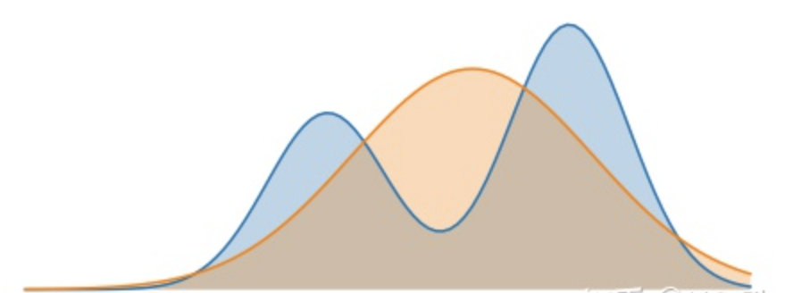
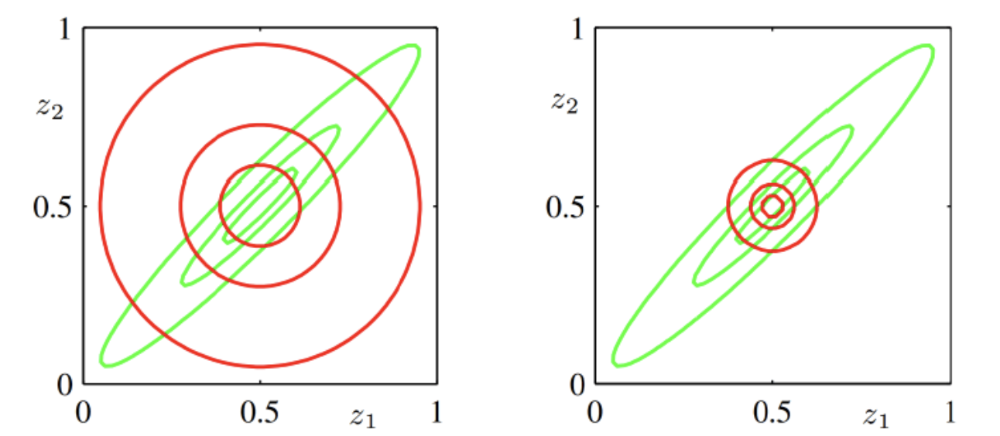
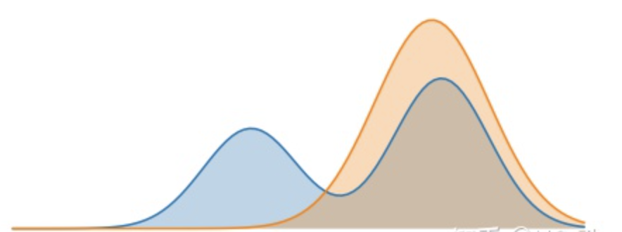
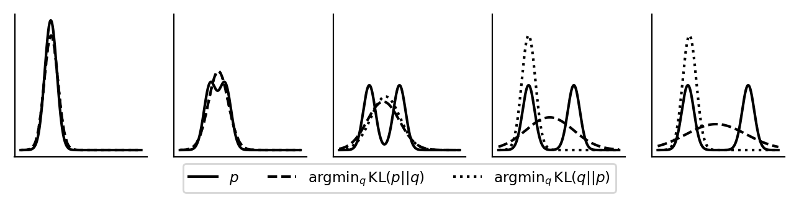

---

layout: post
title: 扩散模型（diffusion model）
category: 计算机视觉
tags: stable_diffusion; VAE; 
keywords: stable_siffusion；KL_divergence；

---

* TOC
{:toc}

## 背景

**Stable Diffusion**是一种[扩散模型](https://zh.wikipedia.org/wiki/扩散模型)（diffusion model）的变体，叫做“潜在扩散模型”（latent diffusion model; LDM）。扩散模型是在2015年推出的，其目的是消除对训练图像的连续应用[高斯噪声](https://zh.wikipedia.org/wiki/高斯噪声)，可以将其视为一系列去噪[自编码器](https://zh.wikipedia.org/wiki/自编码器)。Stable Diffusion由3个部分组成：[变分自编码器](https://zh.wikipedia.org/wiki/变分自编码器)（VAE）、[U-Net](https://zh.wikipedia.org/wiki/U-Net)和一个文本编码器。

### VAE

**变分自编码器（Variational Autoencoder，VAE）**是由Diederik P. Kingma和Max Welling提出的一种人工神经结构，属于概率[图模式](https://zh.wikipedia.org/wiki/圖模式)和[变分贝叶斯方法](https://zh.wikipedia.org/w/index.php?title=变分贝叶斯方法&action=edit&redlink=1)。

#### KL 散度

假设给定事件$x$，有以下定义：

1. **Probability**:

​		取值0～1
$$
p(x) 或q(x)
$$

2. **Information**:

   对 $p(x)$​取对数，加符号得正值
   $$
   I(p)=-logp(x)
   $$
   概率越高，包含的信息小，因为事件越来越确定。相反，概率越低，包含的信息越多，因为事件具有很大的不确定性。

3. **(Shannon)Entropy**:

    $p(x)$对$I(p)$平均
   $$
   \begin{aligned}
   H(p) & =\mathbb{E}_{x \sim P}[I(p)] \\
   & =\sum p(x) I(p) \\
   & =-\sum p(x) \log p(x)
   \end{aligned}
   $$

4. **Cross-Entropy:**

   $p(x)$对$I(q)$平均
   $$
   \begin{aligned}H(p,q) & =\mathbb{E}_{x \sim P}[I(q)] \\& =\sum p(x) I(q) \\& =-\sum p(x) \log q(x)\end{aligned}
   $$

​		熵是信息的平均，直观上，交叉熵是信息在**不同分布**下的平均。

5. **Kullback-Leibler divergence(KL散度，Relative entropy/Information gain)**:
   $$
   \begin{aligned}
   D_{K L}(p \| q) & =H(p, q)-H(p) \\
   & =-\sum p(x) \log q(x)+\sum p(x) \log p(x) \\
   & =-\sum p(x) \log \frac{q(x)}{p(x)} \\
   & =\sum p(x) \log \frac{p(x)}{q(x)}
   \end{aligned}
   $$

**思考：**

- - **(shannon)熵** $H(p)$是传输一个随机变量状态值所需的比特位下界（最短平均编码长度）。**(shannon)熵可以描述系统的混乱程度，是系统有序化程度的一个度量**。随机变量的取值个数越多，状态数也就越多，信息熵就越大，混乱程度就越大，系统越无序。概率为0或1的事件的熵为0，随机变量为均匀分布时熵最大。$0 < 非均匀分布的熵 < 均匀分布的熵$

  - **交叉熵** $H(p,q)$是指用分布 $q$ 来表示本来表示分布 $p$ 的平均编码长度。

  - **相对熵**（**即KL散度**） $D_{KL}(p \|q)$可以用来衡量两个概率分布之间的差异，其意义就是求 $p$  与 $q$  之间的对数差在  $p$ 上的期望值，对应用 $q$  来表示分布 $p$ 额外需要的编码长度。

    **KL散度的一些性质：**

    - 非对称性。$D_{K L}(p \| q) \neq D_{K L}(q \| p)$，亦不满足三角不等式，故不是距离。
    - 非负性。$D_{KL}(p \|q)$ 为$p$相对于 $q$，值非负，若 $p=q$ 取零。从公式上看，就是拿 $q$ 替代 $p$ 后熵的变化。  
    - 凹性。

- **相对熵 = 交叉熵 - (shannon)熵**。当用非真实分布 $q(x)$ 得到的平均码长比真实分布$p(x)$ 得到的平均码长多出的比特数就是相对熵。又因为$D_{K L}(p \| q)≥0$所以$H(p,q)≥H(p)$（当 $p(x)=q(x)$ 时取等号，此时交叉熵等于信息熵）并且当 $H(p)$ 为**常量**时（**注：在机器学习中，训练数据分布是固定的**）**最小化相对熵** $DKL(p||q)$等价于**最小化交叉熵** $H(p,q)$ 也等价于**最大化似然估计**。在机器学习中，我们希望**训练数据上模型学到的分布** $P(model)$ 和**真实数据的分布** $P(real)$ **越接近越好**，**所以我们可以使其相对熵最小**。但是我们没有真实数据的分布，所以只能希望模型学到的分布 $P(model)$ 和训练数据的分布 $P(train)$ 尽量相同。假设训练数据是从总体中独立同分布采样的，那么我们可以通过最小化训练数据的经验误差来降低模型的泛化误差。即：

  1. 希望希望学到的模型的分布和真实分布一致， $P(model)$ ≃ $P(real)$ 

  2. 但是真实分布不可知，假设训练数据是从真实数据中独立同分布采样的 $P(train)$ ≃ $P(real)$ 

  3. 因此，我们希望学到的模型分布至少和训练数据的分布一致， $P(train)$ ≃ $P(model)$ 

  根据之前的描述，最小化训练数据上的分布 $P(train)$ 与最小化模型分布 $P(model)$ 的差异等价于最小化相对熵，即 $DKL(P(train)||P(model))$。此时， $P(train)$就是$DKL(p||q)$ 中的 $p$，即真实分布，$P(model)$就是 $q$。又因训练数据的分布 $p$ 是给定的，所以求 $DKL(p||q)$ 等价求 $H(p,q)$。**得证，交叉熵可以用来计算学习模型分布与训练分布之间的差异**。交叉熵广泛用于逻辑回归的`Sigmoid`和`Softmax`函数中作为损失函数使用。

- **最小化KL散度**

  如果假定已知随机变量 $p$，求相对简单的随机变量 $q$，使得 $q$ 尽量接近 $p$。如何做呢？我们很容易想到可以使用最小化 $p$和 $q$的相对熵来求，但是 $D_{K L}(p \| q)$和 $D_{K L}(q \| p)$ 到底用哪个？这两种方式到底有什么区别呢？
  
  为了方便说明，我们基于定义在某个空间$\chi$上的分布 $p$ 和 $q_{\theta}$ 来重写一下KL， 如下所示：
  $$
  D_{K L}(p \| q_{\theta})=\sum_x p(x)\left[\log \frac{p(x)}{q_{\theta}(x)}\right] = \mathbb{E}_{x \sim p}\left[\log \frac{p(X)}{q_{\theta}(X)}\right]
  $$
  $D_{K L}(p \| q_{\theta})$ : **$p$ 基于 $q_{\theta}$ 的KL**，或从 $q_{\theta}$ 到 $p$ 的KL，此处称为**正向KL（Forward KL）**。
  
  $D_{K L}(q_{\theta} \| p)$ : **$q_{\theta}$ 基于 $p$ 的KL**，或从 $p$ 到 $q_{\theta}$ 的KL，此处称为**反向KL（Reverse KL）**。
  
  假设，$p$为真实的分布函数，我们想要用带参数$\theta$的分布函数$q_{\theta}$，去近似 $p$。也就是说，通过选取参数 $\theta$， 让 $q_{\theta}$ 和 $p$ 在某种意义上具有相似性。下面，我们分别将选取正向KL和反向KL做为目标函数进行说明。为了方便，我们假设 $p$ 为双峰分布，$q_{\theta}$ 为正态分布，故 $\theta$ 包含均值和方差两个参数。

- **最小化正向KL目标函数**

  目标函数为：

$$
\begin{aligned}
& \arg \min _\theta D_{K L}\left(p \| q_\theta\right) \\
& =\arg \min _\theta \sum_x p(x)\left[\log \frac{p(x)}{q_{\theta}(x)}\right] \\
& =\arg \min _\theta \mathbb{E}_{x \sim p}\left[\log \frac{p(X)}{q_\theta(X)}\right] \\
& =\arg \min _\theta \mathbb{E}_{x \sim p}\left[-\log q_\theta(X)\right]-H[p(X)] \\
& =\arg \min _\theta \mathbb{E}_{x \sim p}\left[-\log q_\theta(X)\right] \\
& =\arg \max _\theta \mathbb{E}_{x \sim p}\left[\log q_\theta(X)\right]
\end{aligned}
$$

从公式直观来看，这个公式是对随机变量的每个取值上， $\log \frac{p(X)}{q_\theta(X)} $ 这个值的加权平均，正向 KL 散度中的的权值是 $p(x)$ （实际上是算了个期望）。

当随机变量的某个取值的概率 $𝑝(𝑥)=0$ 时，因为 $𝑝(𝑥)$ 是权值，后面 $\log \frac{p(x)}{q_\theta(x)}$产生影响，此时 KL 散度最小值是 0（也就意味着两个分布没有 “距离”，完全匹配），而 $𝑞(𝑥)$ 是多少都无所谓。

相应地，当随机变量某个取值的概率 $𝑝(𝑥)$>0 时，此时后面的$\log \frac{p(x)}{q_\theta(x)} $这一项就会对整体的 KL 散度大小产生影响，可以发现，$q_\theta(x)$  作为分母，要尽量大一些才能保证 KL 散度小。

总体而言，对于正向 KL 散度，在 $𝑝(𝑥)$ 大的地方，想让 KL 散度小，就需要 $𝑞(𝑥)$ 的值也尽量大；在 $𝑝(𝑥)$ 小的地方，$𝑞(𝑥)$ 对整体 KL 影响并不大（因为在$\sum_{x} p(x)\left[\log \frac{p(x)}{q_{\theta}(x)}\right]$ 中，$\log \frac{p(X)}{q_\theta(X)} $项本身分子很小，又乘了一个非常小的 $𝑝(𝑥)$）。换一种说法，要想使正向 KL 散度最小，则要求在 $p$ 不为 0 的地方，$q$ 也尽量不为 0，所以**正向 KL 散度被称为是 zero avoiding**。此时得到的分布 $q$ 是一个比较 “宽” 的分布，可见下方两种分布的对比图。

所以有下图**mean-seeking**的结果

- **最小化反向KL目标函数**

- 目标函数为：

$$
\begin{aligned}
& \arg \min _\theta D_{K L}\left(q_\theta \| p\right) \\
& =\arg \min _\theta \sum_x q_{\theta}(x)\left[\log \frac{q_{\theta}(x)}{p(x)}\right] \\
& =\arg \min _\theta \mathbb{E}_{x \sim q_\theta}\left[\log \frac{q_\theta(X)}{p(X)}\right] \\
& =\arg \min _\theta \mathbb{E}_{x \sim q_\theta}\left[-\log p(X)\right]-H[q_\theta(X)] \\
& =\arg \max _\theta \mathbb{E}_{x \sim q_\theta}\left[\log p(X)\right] + H[q_\theta(X)]
\end{aligned}
$$

公式与正向 KL 散度类似，不过这回权值成了 $𝑞(𝑥)$。

当随机变量的某个取值概率 $𝑞(𝑥)=0$ 时，对 $𝑝(𝑥)>0$ 的地方，我们完全可以忽略，因为对整体 KL 散度并没有什么影响。

而当随机变量的某个取值概率 $𝑞(𝑥)>0$ 时，必须得保证 $𝑞(𝑥)$ 在 $𝑝(𝑥)$ 小的地方也尽量小，才能使整体 KL 散度变小。

总体而言，对于反向 KL 散度，在 $𝑝(𝑥)$ 小的地方，想让 KL 散度小，就需要 $𝑞(𝑥)$ 的值也尽量小；在 $𝑝(𝑥)$ 大的地方，可以适当的忽略。换一种说法，要想使反向 KL 散度最小，则要求在 $p$ 为 0 的地方，$q$ 也尽量为 0，所以**反向 KL 散度被称为是 zero forcing** (由于q的正态分布的约束，zero forcing迫使 $q$ 逼近 $p$ 的某个单峰，并倾向于选择高窄的单峰，因为在 $\sum_{x} q_{\theta}(x)[\log \frac{q_{\theta}(x)}{p(x)}]$ 中，若$p$ 越窄，则 $𝑞_\theta(𝑥)$上的 $x$ 取值越少，KL散度越小； $𝑞(𝑥)$越大，KL散度越小。

此时得到分布 $q$ 是一个比较 “窄” 的分布，可见下方两种分布的对比图（**mean-seeking与mode-seeking**）。

上图绿色和红色曲线分别为 $p$与$q$ 的等高线

左：正向；右：反向

另外，从上图也能看出，**正向 KL 散度的分布会偏一般化，而反向 KL 散度的分布会偏特别化。**

拓展：如果p是两个高斯分布的混合，另q为单个高斯分布。那么两种KL散度如何选择？

由于正向 KL 散度和反向 KL 散度各自的特点，q 在 “贴近”p 的时候，会出现下图的区别：

    
      
   

上面左图是最小化 𝐷𝐾𝐿(𝑝||𝑞) 的效果。在这种情况下，我们选择一个 $q$ 使得它在 $p$ 具有高概率的地方具有高概率，意味着在优化过程中，**更在意真实分布 $p$ 中的常见事件**，也就是蓝线的两峰，我们要优先确保它们在分布 $q$ 中不是特别罕见（信息长度不是特别长）。当 $p$ 具有多个峰时，$q$ 选择将这些峰模糊到一起，以便将高概率质量放到所有峰上。

上面右图是最小化 𝐷𝐾𝐿(𝑞||𝑝) 的效果。在这种情况下，我们选择一个 q 使得它在 p 具有低概率的地方具有低概率，意味着在优化过程中，**更在意真实分布 p 中的罕见事件**，也就是蓝线的谷底，我们要优先确保它们在分布 q 中不是特别常见（信息长度特别长的那些事件）。当 p 具有多个峰并且这些峰间隔很宽时，如该图所示，最小化 KL 散度会选择单个峰，以避免将概率质量放置在 p 的多个峰之间的低概率区域中。图中是当 q 被选择成强调左边峰时的结果，我们也可以通过选择右边峰来得到 KL 散度相同的值。如果这些峰没有被足够强的低概率区域分离，那么 KL 散度的这个方向仍然可能选择模糊这些峰。

Reverse KL 和 Forward KL的直观对比 [出处](https://www.tuananhle.co.uk/notes/reverse-forward-kl.html)

- **KL散度的应用**

  - **前向KL散度的应用场景**

    在监督学习领域，常常隐含使用前向KL作为训练代价，这是因为前面提到的前向KL散度代价与极大似然估计的等价性。

  - 反向KL散度的应用场景

    在贝叶斯推理（Bayesian Inference）相关领域，特别是变分贝叶斯（Variational Bayes），反向KL被广泛使用。此外变分自编码机（VAE, Variational Autoencoder）的推导过程中也用到了反向KL，强化学习中也用到了反向KL。

  > 实际应用中的真实分布 $p$ 往往是多峰（multimodal）分布，即在拟合时KL代价存在多个局部极小值点，如果通过调整参数使得近似分布  $q$  能够较好的拟合其中之一（反向KL代价作为优化目标时的特性）即可确保代价至少达到一个局部极小。另一方面，代价的多个局部极小值对应的随机变量取值的平均值（前向KL代价作为优化目标时的特性）往往既不是代价的全局最小值也不是局部极小值，这显然不是我们所希望的。
