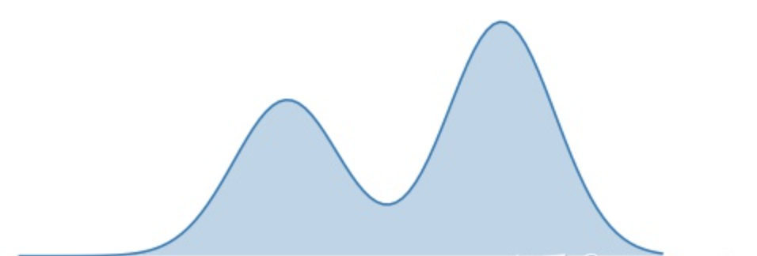

---

layout: post
title: 扩散模型（diffusion model）
category: 计算机视觉
tags: Stable Diffusion; VAE; 
keywords: Stable Diffusion；KL divergence；

---

## 背景

**Stable Diffusion**是一种[扩散模型](https://zh.wikipedia.org/wiki/扩散模型)（diffusion model）的变体，叫做“潜在扩散模型”（latent diffusion model; LDM）。扩散模型是在2015年推出的，其目的是消除对训练图像的连续应用[高斯噪声](https://zh.wikipedia.org/wiki/高斯噪声)，可以将其视为一系列去噪[自编码器](https://zh.wikipedia.org/wiki/自编码器)。Stable Diffusion由3个部分组成：[变分自编码器](https://zh.wikipedia.org/wiki/变分自编码器)（VAE）、[U-Net](https://zh.wikipedia.org/wiki/U-Net)和一个文本编码器。

### VAE

**变分自编码器（Variational Autoencoder，VAE）**是由Diederik P. Kingma和Max Welling提出的一种人工神经结构，属于概率[图模式](https://zh.wikipedia.org/wiki/圖模式)和[变分贝叶斯方法](https://zh.wikipedia.org/w/index.php?title=变分贝叶斯方法&action=edit&redlink=1)。

VAE

#### KL 散度

假设给定事件$x$，有以下定义：

1. **Probability**:

​		取值0～1
$$
p(x) 或q(x)
$$

2. **Information**:

   对 $p(x)$​取对数，加符号得正值
   $$
   I(p)=-logp(x)
   $$
   概率越高，包含的信息小，因为事件越来越确定。相反，概率越低，包含的信息越多，因为事件具有很大的不确定性。

3. **(Shannon)Entropy**:

    $p(x)$对$I(p)$平均
   $$
   \begin{aligned}
   H(p) & =\mathbb{E}_{x \sim P}[I(p)] \\
   & =\sum p(x) I(p) \\
   & =-\sum p(x) \log p(x)
   \end{aligned}
   $$

4. **Cross-Entropy:**

   $p(x)$对$I(q)$平均
   $$
   \begin{aligned}H(p,q) & =\mathbb{E}_{x \sim P}[I(q)] \\& =\sum p(x) I(q) \\& =-\sum p(x) \log q(x)\end{aligned}
   $$

​		熵是信息的平均，直观上，交叉熵是信息在**不同分布**下的平均。

5. **Kullback-Leibler divergence(KL散度，Relative entropy/Information gain)**:
   $$
   \begin{aligned}
   D_{K L}(p \| q) & =H(p, q)-H(p) \\
   & =-\sum p(x) \log q(x)+\sum p(x) \log p(x) \\
   & =-\sum p(x) \log \frac{q(x)}{p(x)} \\
   & =\sum p(x) \log \frac{p(x)}{q(x)}
   \end{aligned}
   $$

**思考：**

- - **(shannon)熵** $H(p)$是传输一个随机变量状态值所需的比特位下界（最短平均编码长度）。

  - **交叉熵** $H(p,q)$是指用分布 $q$ 来表示本来表示分布 $p$ 的平均编码长度。

  - **相对熵**（**即KL散度**） $D_{KL}(p \|q)$可以用来衡量两个概率分布之间的差异，其意义就是求 $p$  与 $q$  之间的对数差在  $p$ 上的期望值，对应用 $q$  来表示分布 $p$ 额外需要的编码长度。

    **KL散度的一些性质：**

    - 非对称性。$D_{K L}(p \| q) \neq D_{K L}(q \| p)$，亦不满足三角不等式，故不是距离。
    - 非负性。$D_{KL}(p \|q)$ 为$p$相对于 $q$，值非负，若 $p=q$ 取零。从公式上看，就是拿 $q$ 替代 $p$ 后熵的变化。  
    - 凹性。

- **相对熵 = 交叉熵 - (shannon)熵**。当用非真实分布 $q(x)$ 得到的平均码长比真实分布$p(x)$ 得到的平均码长多出的比特数就是相对熵。又因为$D_{K L}(p \| q)≥0$所以$H(p,q)≥H(p)$（当 $p(x)=q(x)$ 时取等号，此时交叉熵等于信息熵）并且当 $H(p)$ 为**常量**时（**注：在机器学习中，训练数据分布是固定的**）**最小化相对熵** $DKL(p||q)$等价于**最小化交叉熵** $H(p,q)$ 也等价于**最大化似然估计**。在机器学习中，我们希望**训练数据上模型学到的分布** $P(model)$ 和**真实数据的分布** $P(real)$ **越接近越好**，**所以我们可以使其相对熵最小**。但是我们没有真实数据的分布，所以只能希望模型学到的分布 $P(model)$ 和训练数据的分布 $P(train)$ 尽量相同。假设训练数据是从总体中独立同分布采样的，那么我们可以通过最小化训练数据的经验误差来降低模型的泛化误差。即：

  1. 希望希望学到的模型的分布和真实分布一致， $P(model)$ ≃ $P(real)$ 

  2. 但是真实分布不可知，假设训练数据是从真实数据中独立同分布采样的 $P(train)$ ≃ $P(real)$ 

  3. 因此，我们希望学到的模型分布至少和训练数据的分布一致， $P(train)$ ≃ $P(model)$ 

  根据之前的描述，最小化训练数据上的分布 $P(train)$ 与最小化模型分布 $P(model)$ 的差异等价于最小化相对熵，即 $DKL(P(train)||P(model))$。此时， $P(train)$就是$DKL(p||q)$ 中的 $p$，即真实分布，$P(model)$就是 $q$。又因训练数据的分布 $p$ 是给定的，所以求 $DKL(p||q)$ 等价求 $H(p,q)$。**得证，交叉熵可以用来计算学习模型分布与训练分布之间的差异**。交叉熵广泛用于逻辑回归的`Sigmoid`和`Softmax`函数中作为损失函数使用。

- **最小化KL散度**

  为了方便说明，我们基于定义在某个空间$\chi$上的分布 $p$ 和 $q_{\theta}$ 来重写一下KL， 如下所示：
  $$
  D_{K L}(p \| q_{\theta})=\mathbb{E}_{x \sim p}\left[\log \frac{p(X)}{q_{\theta}(X)}\right]
  $$
  $D_{K L}(p \| q_{\theta})$ : **$p$ 基于 $q_{\theta}$ 的KL**，或从 $q_{\theta}$ 到 $p$ 的KL，此处称为**正向KL**。
  
  $D_{K L}(q_{\theta} \| p)$ : **$q_{\theta}$ 基于 $p$ 的KL**，或从 $p$ 到 $q_{\theta}$ 的KL，此处称为**反向KL**。
  
  假设，$p$为真实的分布函数，我们想要用带参数$\theta$的分布函数$q_{\theta}$，去近似$p$。也就是说，通过选取参数 $\theta$， 让 $q_{\theta}$ 和 $p$ 在某种意义上具有相似性。下面，我们分别将选取正向KL和反向KL做为目标函数进行说明。为了方便，我们假设 $p$ 为双峰分布，$q_{\theta}$ 为正态分布，故 $\theta$ 包含均值和方差两个参数。

